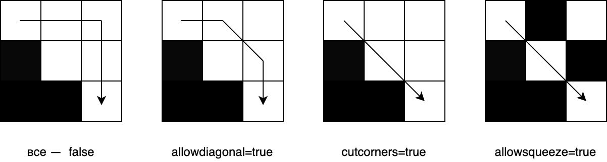

## Тестирование 
Linux

[](https://travis-ci.org/rekrutik/PathPlanningProject)

Windows:

[](https://ci.appveyor.com/project/rekrutik/pathplanningproject/branch/master)

## Описание

Программа создана для поиска кратчайшего пути на прямоугольной сетке с помощью алгоритмов Дейкстры или A*.

## Входные данные

Программа запускается из командной строки и принимает единственный аргумент — имя XML-файла с входными данными:
```bash
./PathPlanningProject <имя файла>
```

Корневой тэг входного файла — `root` — содержит следующие тэги:
+ `map`
    + `width`, `height` — ширина и высота карты соответственно
    + `cellsize` — длина стороны клетки
    + `startx`, `starty` — координаты стартовой клетки
    + `finishx`, `finishy` — координаты финишной клетки
    + `grid` — прямоугольная сетка, содержащая `height` тэгов `row`
        + `row` — строка сетки, состоящая из `width` нулей (свободных клеток) или единиц (препятствий), разделенных пробелами
+ `algorithm` — описание алгоритма
    + `searchtype` — тип алгоритма `astar` (алгоритм A*), `dijkstra` (алгоритм Дейкстры) или `arastar` (алгоритм ARA*).
    + `metrictype` — эвристика при использовании алгоритма A*, обозначающая расстояние между текущей и финишной клетками
        + `euclidean` — евклидова метрика $`\sqrt{dx^2+dy^2}`$
        + `manhattan` — манхэттенская метрика $`|dx| + |dy|`$
        + `chebyshev` — метрика Чебышева $`max(|dx|, |dy|)`$
        + `diagonal` — диагональная метрика $`|dx - dy| + \sqrt{2}(max(dx, dy) - |dx - dy|)`$
    + `breakingties` — порядок посещения клеток в случае, если суммы пройденного расстояния и эвристики равны: `g-min`, если сначала посещается вершина с минимальным пройденным расстоянием, `g-max` иначе.
    + `hweight` — вес эвристики (значение, на которое домножается посчитанная эвристика)
    + `hstep` — шаг изменения эвристики при использовании алгоритма ARA*.
    + `allowdiagonal` — `true`, если разрешено ходить по диагонали, `false` иначе
    + `cutcorners` — `true`, если разрешено срезать по диагонали по занятой клетке, `false` иначе
    + `allowsqueeze` — `true`, если разрешено срезать по диагонали между двух занятых клеток, `false` иначе



## Результат работы

В результате работы программы создается лог-файл (с названием в формате `имя_входного_файла_log.xml`), содержащий всю информацию из входного файла, а также следующие тэги внутри тэгов `result` для каждого полученного результата поиска (несколько результатов при использовании ARA* и один иначе):
+ `summary` — информация о работе программы
    + `numberofsteps` — количество шагов, сделанных алгоритмом
    + `nodecreated` — количество созданных алгоритмом ячеек с информацией о поиске
    + `length` — длина кратчайшего пути в клетках
    + `length_scaled` — `length`, умноженная на `cellsize`
    + `time` — время работы алгоритма поиска
+ `path` — путь на карте, если он найден, обозначенный символами `*`.
+ `lplevel`— путь в виде списка 
+ `hppath` — путь в виде отрезков с постоянным направлением

## Примеры файлов

Пример входного файла [здесь](Examples/example.xml), результата работы алгоритма на нем [здесь](Examples/example_log.xml).

## Сборка

Сборку проекта возможно осуществить двумя способами:
- Используя QtCreator и qmake;
- Используя CMake.
  
При использовании QtCreator требуется открыть файл `ASearch.pro` который находится в директории `.../PathPlanningProject/Src/` и настроить проект с нужным комплектом сборки.


После выбора проекта требуется установить имя входного файла как аргумент командной строки. В качестве первого примера используйте файл `.../PathPlanningProject/Examples/example.xml`. Для установки аргументов командной строки перейдите в настройки запуска проекта и введите нужный путь к файлу в поле "Параметры командной строки".


После установки аргумента командной строки можно проверить работу программы. Следующий результат должен отобразиться в результате запуска:

```
Parsing the map from XML:
Map OK!
Parsing configurations (algorithm, log) from XML:
short
Warning! Value of 'logpath' tag is missing!
Value of 'logpath' tag was defined to 'current directory'.
Warning! Value of 'logfilename' tag is missing.
Value of 'logfilename' tag was defined to default (original filename +'_log' + original file extension.
Configurations OK!
Creating log channel:
Log OK!
Start searching the path:
Search is finished!
Path NOT found!
numberofsteps=0
nodescreated=0
time=0
Results are saved (if chosen) via created log channel.
```

При использовании CMake сборка и запуск может производиться как из командной строки, так и при помощи различных IDE (например JetBrains CLion). Ниже приведены скрипты сборки и запуска с использованием командной строки.

### Linux и Mac
Release сборка:
```bash
cd PathPlanningProject
cd Build
cd Release
cmake ../../ -DCMAKE_BUILD_TYPE="Release"
make
make install
```

Debug сборка:
```bash
cd PathPlanningProject
cd Build
cd Debug
cmake ../../ -DCMAKE_BUILD_TYPE="Debug"
make
make install
```

Запуск:
```bash
cd ../../Bin/{Debug|Release}/
./PathPlanning ../../Examples/example.xml
```
Результат запуска:


### Windows
Release сборка:
```cmd
cd PathPlanningProject
cd Build
cd Release
set PATH
cmake ../../ -DCMAKE_BUILD_TYPE="Release" -G "MinGW Makefiles"
mingw32-make
mingw32-make install
```

Debug сборка:
```cmd
cd PathPlanningProject
cd Build
cd Debug
set PATH
cmake ../../ -DCMAKE_BUILD_TYPE="Debug" -G "MinGW Makefiles"
mingw32-make
mingw32-make install
```

Запуск:
```cmd
cd ../../Bin/{Debug|Release}/
PathPlanning.exe ../../Examples/example.xml
```

Результат запуска:


